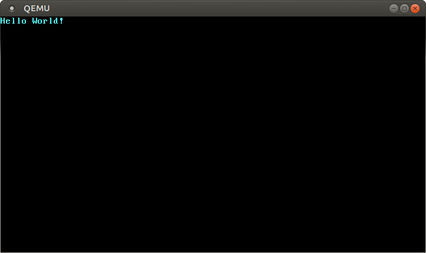

README SOBRE COMO EJECUTAR ESTE KERNEL

(Pulsa Ctrl+Mayus+V para tener una vision mejor del documento en VSCode)

ESTE ES LA CONTINUACION DE EL KERNER MINIMO QUE HEMOS HECHO ANTERIORMENTE, EN ESTE AMPILIAMOS EL MODULO VGA Y LOS SIGUIENTES PASOS LOS CUALES NO HEMOS CONSEGUIDO CONTINUAR.

(SE PUEDE CONTINUAR A PARTIR DE LA LINEA 262 QUE ES DONDE EMPEZAMOS CON EL MODULO VGA)

MINIMAL RUST KERNEL:

blog sobre el que se basa: https://os.phil-opp.com

-- CREACION DE UN KERNEL BINARIO INDEPENDIENTE --

## Parte 1: creación del cargo de rust

``cargo new SO --bin --edition 2018``

creamos un nuevo cargo para almacenar nuestro proyecto en rust, establecemos la version del 2018

## Parte 2: "Start point"

Normalmente un programa necesita de un punto de inicio adicional que no es el propio main, sino un punto "crt0" que prepara la ejecución del resto del binario y que en el caso de Rust incluye salvaguardas contra los overflows y otras cosas. Debemos proveer un starting point adecuado dado que el original está en la librería estándar.
Como no tenemos un starting point *per se*, tampoco tiene sentido emplear una función main, así que se puede hacer otra función:

```Rust
//codigo en main.rs
#![no_std]
#![no_main]
#[no_mangle]
pub extern "C" fn _start() -> ! {
    loop {}
}
```

Esto crea una función _start() propia. El atributo ``[no_mangle]`` se asegura de que el compilador no haga **name mangling**, que significa que normalmente se les cambiaría el nombre a las fucniones por IDs propios y nada cómodos de manejar. Lo de ``exetern C`` es para que el compilador emeplea la convención de nominación de C y así volver válido todo esto que estamos haciendo.

Además, deberemos cambiar el contenido de esta función en el futuro. Nótese que devuelve un "never", ya que este binario no será llamado por ninguna función y por lo tanto ningún valor de retorno tiene sentido, pero sí deberemos incluir luego una acción propicia (como apagar la máquina).


## Parte 3: Gestion del estado "panic"

Rust elabora muchas de sus excepciones en torno al conceto de "panic" que conssite en un estado especial que salvaguarda errores de lógica en los programas, como no estamo usando la librería estándar, la definición de panic tampoco existe, así que debemos de hacerla:

```Rust
//añadimos en src/main.rs
use core::panic::PanicInfo;

#[panic_handler]
fn panic(_info: &PanicInfo) -> ! {
    loop {}
}

```
El parámetro PanicInfo contiene información sobre el lugar y estado de la generación del pánico, y hacemos que retorne un tipo "never", *que nunca retorne, vaya*.

**Unwinding**:
Para asegurar la correcta gestión de recursos una vez se entra en estado de pánico, las variables entran en un proceso llamado de "unwinding", que básicamente consiste en un método seguro de hacer "garbage collection" con ellas. Para deshabilitar el unwinding (porque no tenemos una función de pánico funcional y esto además reduciría el tamaño del binario generado), vamos a añadir unas líneas especiales al archivo toml:

```toml
#añadimos en ./cargo.toml pero sin borrar nada de lo que tenemos anteriormente en el archivo

[profile.dev]
panic = "abort"

[profile.release]
panic = "abort"
```

Esto hace que al entrar en pánico el programa directamente aborte, saltándose otros protocolos. 


## Parte 4: Linker Errors

Normalmente al generar código de este estilo en un ejecutable, se asume que se depende del C runtime, es decir, que depende de C. Cada sistema operativo usa una convención distinta de estos linkers, pero podemos asumir que estamos programando cara un objetivo "bare metal", sin sistema.

Estos valores de linkers se identifican en un **triplet** que contiene detalles del sistema objetivo, nosotros debemos añadir un triplet especial para asumir que no lo hay:

``rustup target add thumbv7em-none-eabihf``

Finalmente compilamos usando esta tripleta: 

``cargo build --target thumbv7em-none-eabihf``.

De momento solamente hemos creado un binario que no depende de ningún recurso, pero tampoc hace nada de utilidad.

## Parte 5: Nano-sistema Operativo

Ahora debemos crear un sistema operativo a partir de este binario. Para empezar hay que conocer como arranca un sistema operativo. Al iniciarse, el **firmware** que existe dentro de la ROM comienza a ejecutarse, realizando un "power-on self-test", inicializa la RAM, la CPU... y comienza a cargar el sistema operativo presente en la máquina. De los dos estándares que existen a este respecto:
- "Basic Input/Output System“ (BIOS)
- "Unified Extensible Firmware Interface" (UEFI)
Vamos a emplear el enfoque de BIOS por ser más fácil, ya que es más ubicuo.

## Parte 6: Instalacion de bootloader

Al iniciarse el sistema, una memoria flash especial de la ROM inicia la búsqueda de discos que contengan un sistema operativo estable y se lo pasa (de encontrarse) al **bootloader**, que es una pieza de código de 512 bytes (aunque la mayoría son más grandes y requieren cargarse en secciones de este tamaño) que arranca el sistema en tres etapas consecutivas:
1. **Real mode**: Un modo de arquitectura de 16 bits.
2. **Protected mode**: Un modo de 32 bits protegido.
3. **Long mode**: El modo de 64 bits en el que ya la memoria principal está disponible.

Luego el bootloader carga el mapeo de memoria al propio kernel.

No vamos a crear un bootloader, así que utilizaremos la recomendada herramienta:
"https://github.com/rust-osdev/bootimage", que ya proporciona este servicio para kernels de Rust.

Para evitar que cada sistema use un bootloader distinto la **Free Software Foundation** creó un estándar llamado **Multiboot** que es posible emplear sólo con una cabecera en el kernel. La versión más utilizada en sistemas Linux es el **GRUB**

##
**Como instalar el bootloader segun el enlace**

Primero de todo tenemos que instalar la herramienta:

``cargo install bootimage``

Para poder usar esta herramienta en nuestro codigo, en el cargo.toml de nuestro proyecto

```toml
# in your Cargo.toml

[dependencies]
bootloader = "0.9.8"
```
##

## Parte 7: "Rust Nightly"

Usaremos las funciones del Rust más experimental (nightly), cosa que conseguiremos empleando: 

``rustup override set nightly``

Rust Nightly nos permite optar por varias funciones experimentales mediante el uso de los llamados indicadores de funciones en la parte superior de nuestro archivo

## Parte 8: "Target Specification"

Cargo admite diferentes sistemas de destino a través del parametro --target .El target se describe mediante un archivo en formato JSON en el cual tiene especificaciones de nuestro sistema. En nuestro caso emplearemos un **target triple** adecuado ara una arquitectura x86 de GNU linux
El archivo lo tenemos que ubicar al mismo nivel que la carpeta **src** con un nombre en definimos como: **x86_64-SO.json** 
(por que vamos a usar una arquitectura de x86_64 y por que nuestro proyecto se llama SO)

```Rust
//
{
    "llvm-target": "x86_64-unknown-none",
    "data-layout": "e-m:e-i64:64-f80:128-n8:16:32:64-S128",
    "arch": "x86_64",
    "target-endian": "little",
    "target-pointer-width": "64",
    "target-c-int-width": "32",
    "os": "none",
    "executables": true,
    "linker-flavor": "ld.lld",
    "linker": "rust-lld",
    "panic-strategy": "abort",
    "disable-redzone": true,
    "features": "-mmx,-sse,+soft-float"
}
```

Para poder construir el kernel tenemos que definir antes un archivo de configuración de carga local en **.cargo/config.toml** (tenemos que crear una carpeta que se llame .cargo al mismo nivel que src) con el siguiente contenido: 

```toml
# in .cargo/config.toml

[unstable]
build-std-features = ["compiler-builtins-mem"]
build-std = ["core", "compiler_builtins"]

```

Para permitir esto debemos correr el comando:

``rustup component add rust-src``

,para que Rust pueda acceder al código fuente del propio lenguaje.

Hay que usar el siguiente comando para poder emplear esta configuración:

``rustup install nightly-2020-07-15``

Después de compilar esta versión, no saldrá ningún error.


Ahora podemos construir el kernel para nuestro nuevo objetivo pasando el nombre del archivo JSON como --target:

``cargo build --target x86_64-SO.json``


Vamos a añadir una flag a cargo.toml normal de Rust para no tener que compoilar indicando el target de cada vez: (esta opcion no es obligatoria pero si recomentable)
```toml
# in .cargo/config.toml

[build]
target = "x86_64-blog_os.json"`
```

## Parte 9: Impresion en pantalla

De momento esta función está vacía, así que vamos a intentar programar código para imprimir un "Hello World" por pantalla:

```Rust
static HELLO: &[u8] = b"Hello World!";

#[no_mangle]
pub extern "C" fn _start() -> ! {
    let vga_buffer = 0xb8000 as *mut u8;

    for (i, &byte) in HELLO.iter().enumerate() {
        unsafe {
            *vga_buffer.offset(i as isize * 2) = byte;
            *vga_buffer.offset(i as isize * 2 + 1) = 0xb;
        }
    }

    loop {}
}
```

Estamos empleando el buffer **VGA** que está en la dirección de memoria **0xb8000** y cuyas celdas consisten en un byte para un caracter y otro para su color. El código de acceso al buffer de VGA se encuentra en un bloque unsafe que sirve a Rust como garantía de que es válido, aunque no se pueda asegurar tal cosa.

## Parte 10: Ejecutando nuestro Kernel

Tal y como se adelantaba antes, vamos a necesitar una herramienta que nos supla la necesidad de un bootloader. Para ello vamos a: [https://github.com/rust-osdev/bootimage] y seguimos las instrucciones.

Ejecutamos: 

``rustup component add llvm-tools-preview`` 

para poder luego ejecutar a su vez:

``cargo bootimage --target x86_64-SO.json``

Dee esta  manera podemos compilar nuestro kernel, en caso de haber añadido el flag al **config.toml** tendriamos que compilar solo con **cargo bootimage**

La compilacion crea un fichero de tipo .bin en **~/target/x86_64-SO/debug/bootimage-crate_name.bin** que es el cual tenemos que ejecutar con el QEMU

La herramienta bootimage primero compila nuestro kernel al formato ELF (el de los binarios de linux), luego compila el bootloader por separado como binario independiente, y finalmente enlaza los bytes de uno con el otro.

#### Instalación de QEMU en el entorno escogido (Debian)

Al ir a la página de QEMU es ejecutar el comando adecuado para binarios standalone.

#### Compilación y prueba del kernel:

Los comandos que hay que seguir para compilar el kernel y probarlo en qemu son:

``cargo bootimage --target x86_64-SO.json``

``qemu-system-x86_64 -drive format=raw,file=target/x86_64-SO/debug/bootimage-crate_name.bin ``

##
**Asi es como se mostraria su ejecucion**



##

**Comando para sobreescribir una memoria USB con la imagen adecuada:**

`dd if=target/x86_64-blog_os/debug/bootimage-blog_os.bin of=/dev/sdX && sync`

##

## Parte 11: Creando un modulo para el VGA

Ahora lo ideal sería crear un módulo de rust capaz de abstraer el proceso de acceso al buffer de VGA.

Vamos a crear un módulo en Rust en el direcorio de sources que se llame **vga_buffer.rs**. Y a importarlo desde el main con 
``mod vga_buffer;``.

### Código dentro del módulo:

Primero hacemos un enum con los colores de los bytes. Los colores se representan con Unsigned Integers de 4 bits, pero eso en Rust no existe, así que se usan los de 8.

```Rust
#[allow(dead_code)] // 1
#[derive(Debug, Clone, Copy, PartialEq, Eq)] // 2
#[repr(u8)]
pub enum Color {
    Black = 0,
    Blue = 1,
    Green = 2,
    Cyan = 3,
    Red = 4,
    Magenta = 5,
    Brown = 6,
    LightGray = 7,
    DarkGray = 8,
    LightBlue = 9,
    LightGreen = 10,
    LightCyan = 11,
    LightRed = 12,
    Pink = 13,
    Yellow = 14,
    White = 15,
}
```

APUNTES:
1. Hace que el compilador no avise por las variantes de colores no usadas.
2. Hace que el enum sea printeable y comparable mediante la implementación de **semánticas de copia**.


Añadimos la definición de un struct que permite la implementación de códigos de color para fondo y letra en un solo formato. Dado que le dato que utilizamos es un ``[u4]`` en realidad, podemos concatenar dos veces los dos valores distintos en u8 (véase línea anotada como // 4)

```Rust
#[derive(Debug, Clone, Copy, PartialEq, Eq)]
#[repr(transparent)] // 3
struct ColorCode(u8);

impl ColorCode {
    fn new(foreground: Color, background: Color) -> ColorCode {
        ColorCode((background as u8) << 4 | (foreground as u8)) // 4
    }
}
```

APUNTES:
3. Fuerza la representación como u8 en memoria.


Ahora que hemos añadido una abstracción para el color, podemos añadir otra para los caracteres como tal, y otra para el Buffer.

```Rust
#[derive(Debug, Clone, Copy, PartialEq, Eq)]
#[repr(C)]
struct ScreenChar {
    ascii_character: u8,
    color_code: ColorCode,
}

const BUFFER_HEIGHT: usize = 25;
const BUFFER_WIDTH: usize = 80;

#[repr(transparent)]
struct Buffer {
    chars: [[ScreenChar; BUFFER_WIDTH]; BUFFER_HEIGHT],
}
```

Podemos crear un objeto Writer que facilite la utilización de estos recursos:

```Rust
pub struct Writer {
    column_position: usize,
    color_code: ColorCode,
    buffer: &'static mut Buffer,
}
```

El Writer toma anotación de la posición en pantalla (column_position), del color del caracter y el fondo (color_code), y del buffer (&'static mut Buffer). Esto último necesita explicitar un tiempo de vida para la variable, de momento la palabra static provee un tiempo de vida que ocupa la existencia de todo el programa, lo cual es cierto para el caso del VGA.

Ahora podemos crear métodos sucesivos para interactuar con el buffer VGA:

```Rust
impl Writer {
    pub fn write_byte(&mut self, byte: u8) {
        match byte {
            b'\n' => self.new_line(),
            byte => {
                if self.column_position >= BUFFER_WIDTH {
                    self.new_line();
                }

                let row = BUFFER_HEIGHT - 1;
                let col = self.column_position;

                let color_code = self.color_code;
                self.buffer.chars[row][col] = ScreenChar {
                    ascii_character: byte,
                    color_code,
                };
                self.column_position += 1;
            }
        }
    }

    fn new_line(&mut self) {/*  */}
}
```

Y a partir de ahí podemos implementar 

```Rust
impl Writer {
    pub fn write_string(&mut self, s: &str) {
        for byte in s.bytes() {
            match byte { // este match clasifica los bytes segun el rango al que pertenecen
                0x20..=0x7e | b'\n' => self.write_byte(byte), // rango ASCII que podemos imprimir
                // fuera del rango ASCII
                _ => self.write_byte(0xfe), // el 0xfe es el cuadrado que se pone al no identificar un codigo
            }

        }
    }
}
```

Para probar este módulo podemos hacer una función que trabaje como intermediario:

```Rust
pub fn print_something() {
    let mut writer = Writer {
        column_position: 0,
        color_code: ColorCode::new(Color::Yellow, Color::Black),
        buffer: unsafe { &mut *(0xb8000 as *mut Buffer) },
    };
    writer.write_byte(b'H'); // Esto tendria que funciona que son bytes
    writer.write_string("ola "); // esto prueba la conversion de UTF 8 a ASCII
    writer.write_string("MÜndó"); // esto prueba el caso de letras no presentes en el subset ASCII
}

```

Esta función también estaría dentro del módulo. Vamos a añadir dentro de la función _start() una línea para invocar este código:

``vga_buffer::print_something();``

##
A partir de este paso las cosas empiezan a dar errorres y no somos capaces de crear las macros por la version de las dependencias de Volatile
##

## Parte 12: Volatile

Ahora debemos de preocuparnos de un problema de optimización que puede tener efectos negativos. Como escribimos en el Buffer y nunca leemos de vuelta, una optimización que puede hacer el compilador es eliminar estas operaciones, porque no se da cuenta de en verdad sí que está habiendo un efecto (escribir por pantalla), así que añadimos esto en en Cargo.toml:

```[dependencies]

volatile = "0.2.6"
```

Luego hay que añadirlo: ``cargo add volatile``.

Para indicar a Rust que estas operaciones on volátiles y por lo tanto que ignore esta optimización errónea.

Debemos escribir las siguientes modificaciones en las funciones de nuestro código:

```Rust
use volatile::Volatile;

struct Buffer {
    chars: [[Volatile<ScreenChar>; BUFFER_WIDTH]; BUFFER_HEIGHT],
}

// ...

impl Writer {
    pub fn write_byte(&mut self, byte: u8) {
        match byte {
            b'\n' => self.new_line(),
            byte => {
                ...

                self.buffer.chars[row][col].write(ScreenChar { // el cambio esta aqui (usar un write)
                    ascii_character: byte,
                    color_code,
                });
                ...
            }
        }
    }
    ...
}

```

Ahora podemos pararnos a pensar en dar soporte a las macros de Rust, para poder escribir números, por ejemplo:

```Rust
// src/vga_buffer.rs

use core::fmt;

impl fmt::Write for Writer {
    fn write_str(&mut self, s: &str) -> fmt::Result {
        self.write_string(s);
        Ok(())
    }
}
```

Podemos emplear el core::fmt (para las macros) y emplear específicamente la macro de fmt::Write, cuyo requerimiento es un método para generar un string. Como ya tenemos un método que se parece bastante al por defecto (write_str()), podemos implementarlo sin mayor problema, sobreescribiendo cierta función que habíamos dicho, era temporal:

```Rust
pub fn print_something() {
    use core::fmt::Write;
    let mut writer = Writer { // creamos un elemento Writer de nuestro modulo
        column_position: 0,
        color_code: ColorCode::new(Color::Yellow, Color::Black),
        buffer: unsafe { &mut *(0xb8000 as *mut Buffer) },
    };

    writer.write_byte(b'H');
    writer.write_string("ola! ");
    write!(writer, "Tenemos los numeros {} y {}", 73, 14.0/3.0).unwrap();
}
```

Ahora debemos añadir una implementación que pueda tratar los caracteres en blanco y los "\n", así como una forma de borrar las líneas escritas (introducir un caracter en blanco.)

```Rust
impl Writer {
    fn clear_row(&mut self, row: usize) {
        let blank = ScreenChar {
            ascii_character: b' ',
            color_code: self.color_code,
        };
        for col in 0..BUFFER_WIDTH {
            self.buffer.chars[row][col].write(blank);
        }
    }
}

```

Este método sobreescribe todos los caraccteres de una línea a espacios en blanco.

Ahora podemos crear una implementación de Writer que pueda llamarse globalmente sin tener que crear una instancia de este mismo:

```Rust
pub static WRITER: Writer = Writer {
    column_position: 0,
    color_code: ColorCode::new(Color::Yellow, Color::Black),
    buffer: unsafe { &mut *(0xb8000 as *mut Buffer) },
};
```

Pero este código daría error porque estamos declarando variables estáticas con funciones que no son constantes, lo cual es un problema porque las funciones y variables estáticas se incializan en tiempo de compilación y no de ejecución, esto lleva al problema de que el **const evaluator**, encargado de estos datos, no es capaz de traducir este tipo de referencias en punteros correctamente. Para circunavegar esto podemos añadir al Cargo.toml:

```Rust
[dependencies.lazy_static]
version = "1.0"
features = ["spin_no_std"]
```

O también podríamos declarar la función como un tipo **const**. De todas formas, esta sería la implementación deseada de la función:

```Rust
use lazy_static::lazy_static;

lazy_static! {
    pub static ref WRITER: Writer = Writer {
        column_position: 0,
        color_code: ColorCode::new(Color::Yellow, Color::Black),
        buffer: unsafe { &mut *(0xb8000 as *mut Buffer) },
    };
}
```

<hr>
# Problema con las librerías

Hay algún problema que no logro solucionar al descargar crates exterenos e intentar utilizarlos, pasó con volatile y vuelve a pasar con lazy_static, simplemente no funciona.

En este último caso se descarga forzosamente la versión 1.4, que requiere emplear el crate std, así que requiere volver a compilarlo de base, lo cual no es posible porque depende a su vez de otro crate...

En vez de realizar un exhaustivo trabajo de purga, voy a ignorar la creación de una implementación global de writer, así que cada vez que se quiera emplear se va a tener que crear una instancia del writer original o utilizar la función print_something() como intermediario.

Debido a este mismo motivo me saltaré la parte de los spinlocks
<hr>

### Creación de una macro

Las reglas de definición de macros en Rust son bastante complejas, además, el código proporcionado por el blog no nos va a servir, así que directamente haremos lo siguiente: Vamos a coger el código de las macros para poder definir "println!()" y lo cambiaremos para que se pueda utilizar:

```Rust
// Codigo original del blog
#[macro_export]
macro_rules! print {
    ($($arg:tt)*) => ($crate::vga_buffer::_print(format_args!($($arg)*)));
}

#[macro_export]
macro_rules! println {
    () => ($crate::print!("\n"));
    ($($arg:tt)*) => ($crate::print!("{}\n", format_args!($($arg)*)));
}

#[doc(hidden)]
pub fn _print(args: fmt::Arguments) {
    use core::fmt::Write;
    WRITER.lock().write_fmt(args).unwrap();
}
```

Hice unos apaños al código para que funcionase sin otras librerías.

```Rust
// Codigo arreglado para funcionar con nuestros cambios
#[macro_export]
macro_rules! print {
    ($($arg:tt)*) => ($crate::vga_buffer::_print(format_args!($($arg)*)));
}

#[macro_export]
macro_rules! println {
    () => ($crate::print!("\n"));
    ($($arg:tt)*) => ($crate::print!("{}\n", format_args!($($arg)*)));
}

#[doc(hidden)]
pub fn _print(args: fmt::Arguments) {
    use core::fmt::Write;
    let mut mywriter: Writer = Writer{
        column_position: 0xb8000 as usize,
        color_code: ColorCode::new(Color::Yellow, Color::Black),
        buffer: unsafe { &mut *(0xb8000 as *mut Buffer) },
    };
    mywriter.write_fmt(args).unwrap();
}
```
<hr>

## Problema con las macros

No funcionaban ni las macros ni el codigo de los writers, así que hice un apaño. No existe funcion de println. Sólo existe print_vga, a la cuál se le proporciona lo que se quiere y ya.

<hr>


##

## Anexo: Codigos actuales

**- main.rs:**

```Rust

#![no_std] // don't link the Rust standard library
#![no_main] // disable all Rust-level entry points

use core::panic::PanicInfo;

/// This function is called on panic.
#[panic_handler]
fn panic(_info: &PanicInfo) -> ! {
    loop {}
}

static HELLO: &[u8] = b"Hello World!";

#[no_mangle]
pub extern "C" fn _start() -> ! {
    let vga_buffer = 0xb8000 as *mut u8;

    for (i, &byte) in HELLO.iter().enumerate() {
        unsafe {
            *vga_buffer.offset(i as isize * 2) = byte;
            *vga_buffer.offset(i as isize * 2 + 1) = 0xb;
        }
    }

    loop {}
}

```

**- cargo.toml:**

```toml
[package]
name = "crate_name"
version = "0.1.0"
authors = ["Author Name <author@example.com>"]

# the profile used for `cargo build`
[profile.dev]
panic = "abort" # disable stack unwinding on panic

# the profile used for `cargo build --release`
[profile.release]
panic = "abort" # disable stack unwinding on panic

[dependencies]
bootloader = "0.9.8"    #dependencia para la version bootloader

```


**- config.toml:**
```toml
[unstable]
build-std-features = ["compiler-builtins-mem"]
build-std = ["core", "compiler_builtins"]

[build]
target = "x86_64-SO.json"
```

**- x86_64-SO.json**
```json
{
    "llvm-target": "x86_64-unknown-none",
    "data-layout": "e-m:e-i64:64-f80:128-n8:16:32:64-S128",
    "arch": "x86_64",
    "target-endian": "little",
    "target-pointer-width": "64",
    "target-c-int-width": "32",
    "os": "none",
    "executables": true,
    "linker-flavor": "ld.lld",
    "linker": "rust-lld",
    "panic-strategy": "abort",
    "disable-redzone": true,
    "features": "-mmx,-sse,+soft-float"
}
```

**- vga_buffers.rs**
```Rust
#[allow(dead_code)]
#[derive(Debug, Clone, Copy, PartialEq, Eq)]
#[repr(u8)]
pub enum Color {
    Black = 0,
    Blue = 1,
    Green = 2,
    Cyan = 3,
    Red = 4,
    Magenta = 5,
    Brown = 6,
    LightGray = 7,
    DarkGray = 8,
    LightBlue = 9,
    LightGreen = 10,
    LightCyan = 11,
    LightRed = 12,
    Pink = 13,
    Yellow = 14,
    White = 15,
}

#[derive(Debug, Clone, Copy, PartialEq, Eq)]
#[repr(C)]
struct ScreenChar {
    ascii_character: u8,
    color_code: ColorCode,
}

const BUFFER_HEIGHT: usize = 25;
const BUFFER_WIDTH: usize = 80;

#[repr(transparent)]
struct Buffer {
    chars: [[ScreenChar; BUFFER_WIDTH]; BUFFER_HEIGHT],
}

#[derive(Debug, Clone, Copy, PartialEq, Eq)]
#[repr(transparent)] // 3
struct ColorCode(u8);

impl ColorCode {
    const fn new(foreground: Color, background: Color) -> ColorCode {
        ColorCode((background as u8) << 4 | (foreground as u8)) // 4
    }
}

pub struct Writer {
    column_position: usize,
    color_code: ColorCode,
    buffer: &'static mut Buffer,
    //passer: i32,
}

impl Writer {
    pub fn write_byte(&mut self, byte: u8) {
        match byte {
            b'\n' => self.new_line(),
            byte => {
                if self.column_position >= BUFFER_WIDTH {
                    self.new_line();
                }

                let row = BUFFER_HEIGHT - 1;
                let col = self.column_position;

                let color_code = self.color_code;
                self.buffer.chars[row][col] = ScreenChar {
                    ascii_character: byte,
                    color_code,
                };
                self.column_position += 1;
            }
        }
    }

    fn new_line(&mut self) {/*  */}
}

impl Writer {
    pub fn write_string(&mut self, s: &str) {
        for byte in s.bytes() {
            match byte {
                0x20..=0x7e | b'\n' => self.write_byte(byte),
                _ => self.write_byte(0xfe),
            }

        }
    }
}

impl Writer {
    fn clear_row(&mut self, row: usize) {
        let blank = ScreenChar {
            ascii_character: b' ',
            color_code: self.color_code,
        };
        for col in 0..BUFFER_WIDTH {
            self.buffer.chars[row][col] = ScreenChar {
                ascii_character: b' ',
                color_code: blank.color_code,
            };
        }
    }
}


static mut VGA_BASE: *mut u8=0xb8000 as *mut u8;
pub fn printvga(message: &str) {

    let mut writer = Writer {
        column_position: 0,
        color_code: ColorCode::new(Color::Green, Color::Black),
        buffer: unsafe { &mut *(VGA_BASE as *mut Buffer) },
    };
    writer.write_string(message);
    
    unsafe{VGA_BASE=VGA_BASE.offset(message.len() as isize * 2)};
    //unsafe{VGA_BASE=VGA_BASE.wrapping_add(message.len() as usize)}
}
```